# Ultra Framer Portfolio Clone — Ariel Mello

A pixel-perfect Next.js reference clone of the [Ultra Framer Portfolio Template](https://ultra.framer.website/) customized with **Ariel Mello**'s real software engineering portfolio, career timeline, tech stack, and separated marketing systems architecture.

[](https://nextjs.org/)
[](https://react.dev/)
[](https://tailwindcss.com/)
[](https://vitest.dev/)
[](https://www.typescriptlang.org/)

---

## Visual Previews (Captured via `browser-harness`)

| Page | Preview | Page | Preview |
| :--- | :--- | :--- | :--- |
| **Home (`/`)** | 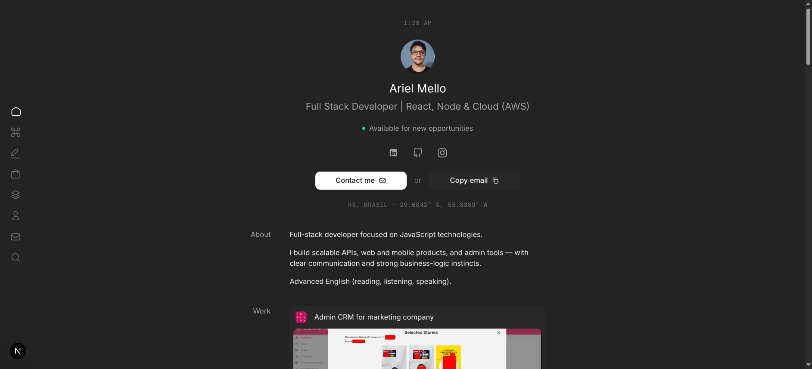 | **About (`/about`)** | 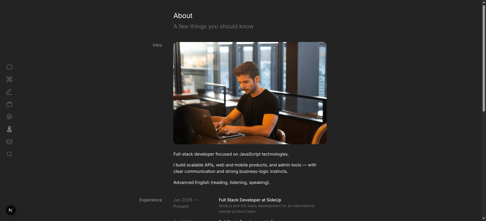 |
| **Stack (`/stack`)** | 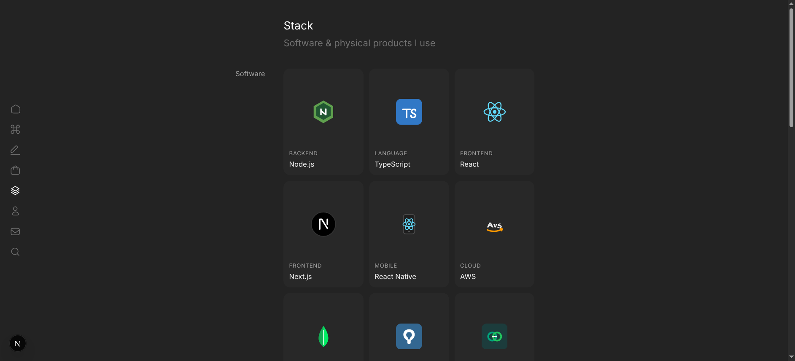 | **Contact (`/contact`)** | 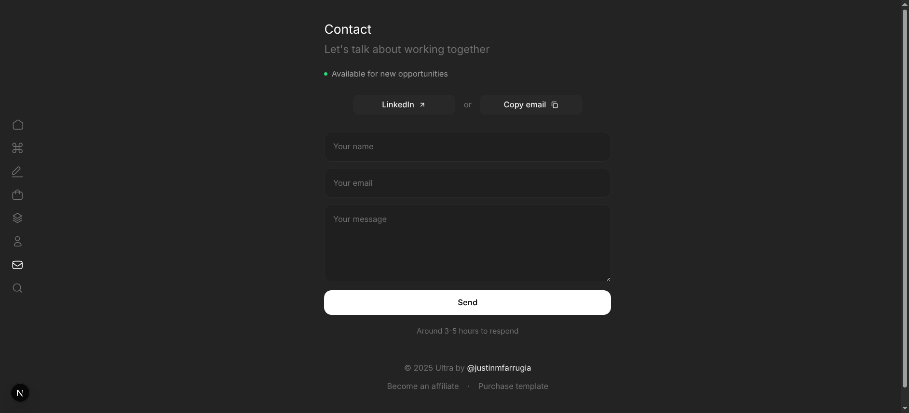 |
| **Admin CRM (`/work/admin-crm`)** | 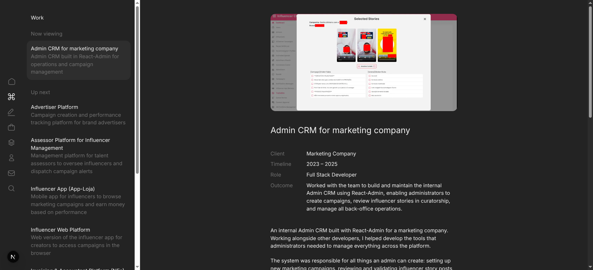 | **Advertiser Platform (`/work/advertisers-platform`)** | 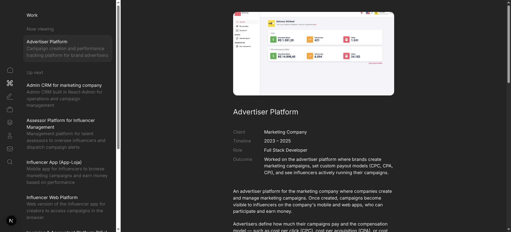 |
| **Assessor Platform (`/work/agencies-platform`)** | 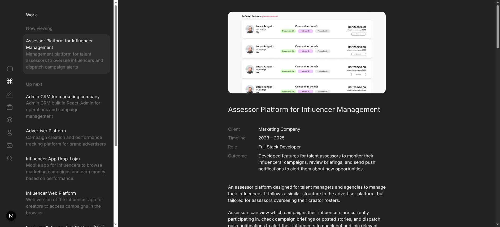 | **Influencer App (`/work/influencer-app`)** | 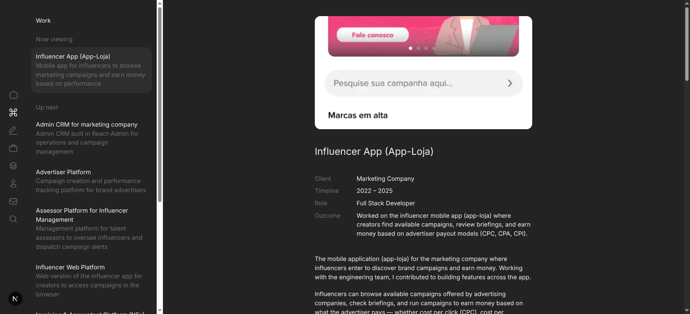 |
| **Influencer Web (`/work/influencer-web`)** | 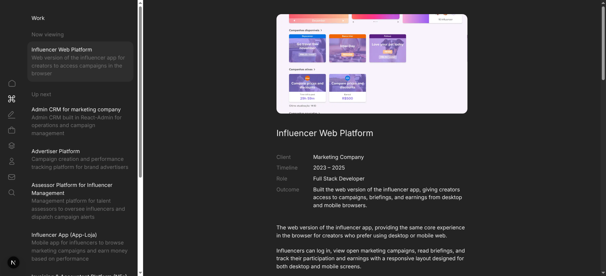 | **Invoicing & NFs (`/work/invoicing-accountant-portal`)** | 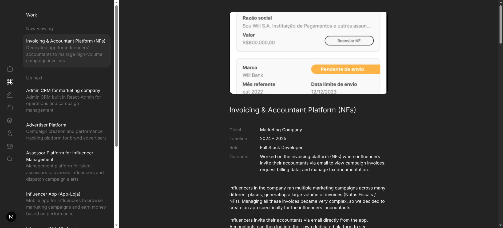 |
| **Writing (`/writing`)** | 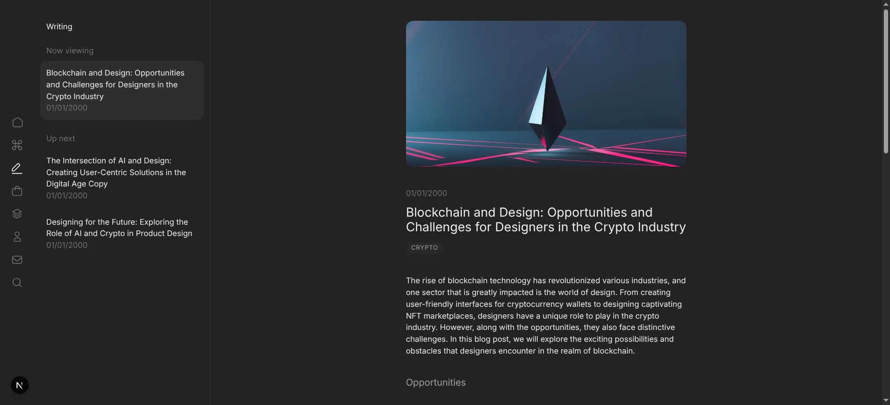 | **Store (`/store`)** | 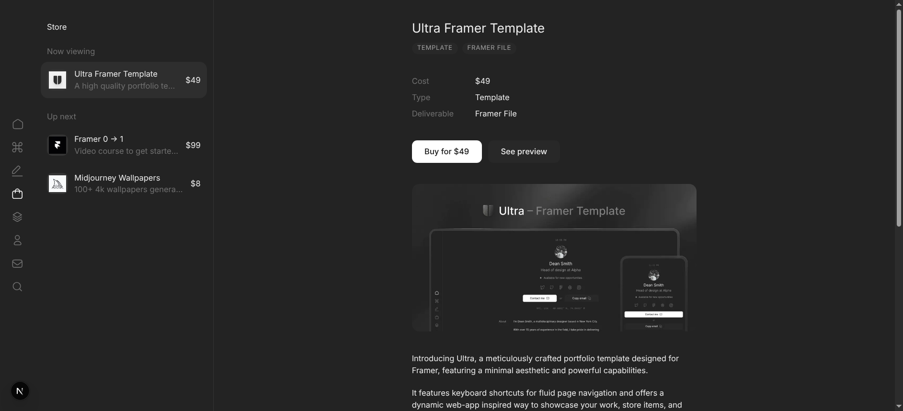 |

---

## Separated Platforms & Works Architecture

The marketing platform projects (previously consolidated under "Infleux") are structured into 6 standalone system showcases, accompanied by real production prints:

1. **Admin CRM for marketing company** (`/work/admin-crm`): Internal Admin CRM built with React-Admin for operations, campaign creation, influencer story curatorship queue, and creator CRM.
2. **Advertiser Platform** (`/work/advertisers-platform`): Brand advertiser platform for creating campaigns with custom compensation models (CPC, CPA, CPI) and real-time story monitoring.
3. **Assessor Platform for Influencer Management** (`/work/agencies-platform`): Talent agency management tool to oversee creator rosters, inspect active campaigns, and dispatch push alerts.
4. **Influencer App (App-Loja)** (`/work/influencer-app`): Creator mobile marketplace application to discover campaigns, review briefings, and earn performance-based payouts.
5. **Influencer Web Platform** (`/work/influencer-web`): Responsive browser alternative for creators to access campaigns and track earnings across desktop and mobile.
6. **Invoicing & Accountant Platform (NFs)** (`/work/invoicing-accountant-portal`): Dedicated financial portal allowing creators to invite accountants via email to review high-volume campaign invoices and tax documentation.
7. **Freelance & Remote Projects**: Retains SideUp (London Node.js team), Upwork CMS (Puck visual editor), and Upwork RAG.

---

## Verification & Quality Gates

- **Vitest Unit & Integration Tests**: 17/17 tests passing across 8 test suites.
- **TypeScript Strict Checking**: `tsc --noEmit` passing with 0 errors.
- **Next.js Production Build**: All 26 routes statically generated (`SSG`).
- **TLC Spec-Driven Compliance**: Full requirement traceability in `.specs/features/`.

---

## Getting Started

### Prerequisites
- Node.js >= 20.x
- npm / pnpm / yarn

### Development Server
```bash
npm install
npm run dev
# Open http://localhost:4100
```

### Test Suite
```bash
npm test
```

### Typecheck & Production Build
```bash
npm run typecheck
npm run build
```

---

## License

MIT License.
